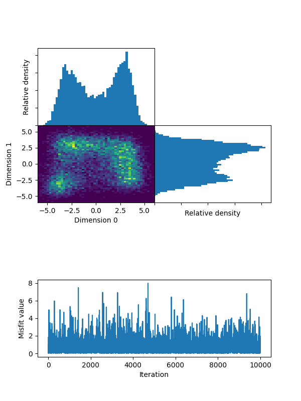
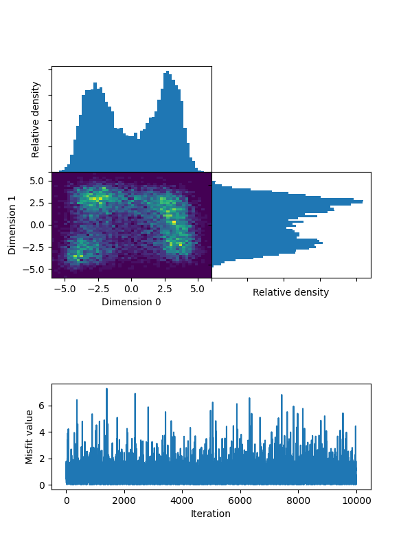
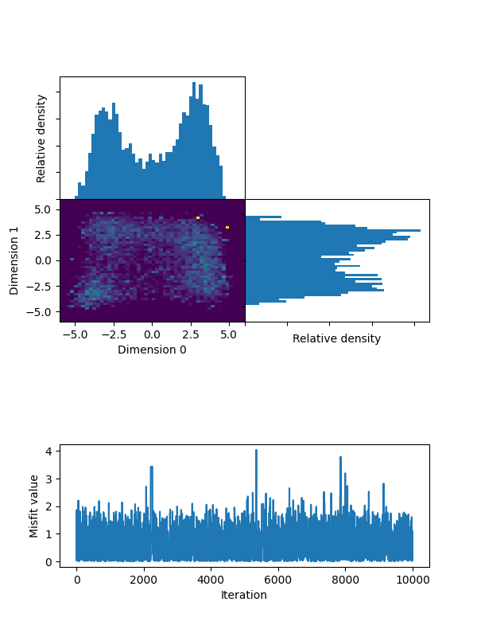
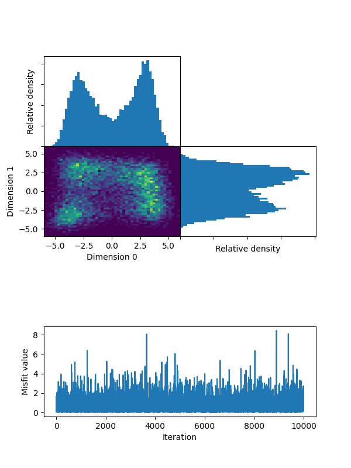
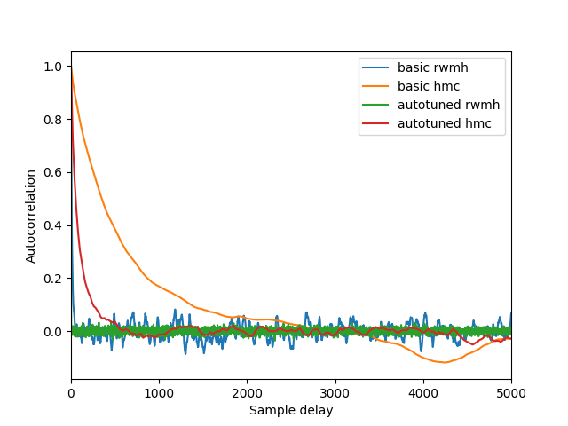

# Himmelblau sampling 1

Tempered Himmelblau target, as described in `himmelblau_1.py`.
All figures can be generated using this file.

Notable is **temperature=100** for the Himmelblau function. What is important is that for this tempering, the local minima are relatively connected,
and typically samplers will switch modes enough to sample accurately.

The configurations presented here are not all optimally tuned, but do approximately run for the same amount of time.

## Configuration 1, basic HMC:

Folder: `./basic_hmc`.

Parameters:

- Hamiltonian Monte Carlo;
- Unit mass matrix;
- leapfrog integrator;
- 0.1 leapfrog stepsize, slightly randomized;
- 10 leapfrog steps, slightly randomized;
- Initial model: zeros;
- 10'000 proposals;
- No online thinning;
- 10'000 output samples;
- `basic_hmc/himmelblau_1_samples_basic_hmc.npy` for samples;
- `basic_hmc/himmelblau_1_misfits_basic_hmc.npy` for misfits;

Statistics:

- Runtime: ~3 seconds
- Proposals per second: 3363.85
- Acceptance rate: 1.0

Result:

## Configuration 2, basic RWMH:

Folder: `./basic_rwmh`.

Parameters:

- Random Walk Metropolis Hastings;
- Isotropic symmetric proposal distribution;
- 0.4 proposal distribution standard deviation;
- Initial model: zeros;
- 200'000 proposals;
- 20x online thinning;
- 10'000 output samples;
- `basic_rwmh/himmelblau_1_samples_basic_rwmh.npy` for samples;
- `basic_rwmh/himmelblau_1_misfits_basic_rwmh.npy` for misfits;

Statistics:

- Runtime: ~3 seconds
- Proposals per second: 53108.77
- Acceptance rate: 0.87

Result:

## Configuration 3, autotuned HMC:

Folder: `./auto_hmc`.

Parameters:

- Hamiltonian Monte Carlo;
- Unit mass matrix;
- leapfrog integrator;
- **autotuned** leapfrog stepsize, slightly randomized;
- 0.65 target acceptance rate;
- 10 leapfrog steps, slightly randomized;
- Initial model: zeros;
- 10'000 proposals;
- No online thinning;
- 10'000 output samples;
- `auto_hmc/himmelblau_1_samples_auto_hmc.npy` for samples;
- `auto_hmc/himmelblau_1_misfits_auto_hmc.npy` for misfits;

Statistics:

- Runtime: ~3 seconds
- Proposals per second: 3281.22
- Acceptance rate: **0.65**

Includes two points where the sampler was stuck during burn-in, but as this is part of sampling, we kept it in. This does mess up the histogram, beware!

Results:

## Configuration 2, autotuned RWMH:

Folder: `./auto_rwmh`.

Parameters:

- Random Walk Metropolis Hastings;
- Isotropic symmetric proposal distribution;
- **Autotuned** proposal distribution standard deviation;
- 0.234 target acceptance rate;
- Initial model: zeros;
- 200'000 proposals;
- 20x online thinning;
- 10'000 output samples;
- `auto_rwmh/himmelblau_1_samples_auto_rwmh.npy` for samples;
- `auto_rwmh/himmelblau_1_misfits_auto_rwmh.npy` for misfits;

Statistics:

- Runtime: ~5 seconds
- Proposals per second: 38481.08
- Acceptance rate: 0.24

Result:

## Autocorrelations

For good measure, here is how the 4 different chains perform on _dimensions 0_, measured by autocorrelation of this dimension. What this quantifies is the amount of proposals needed to produce an independent sample. This point is usually taken as the first time the autocorrelation function crosses the 0.1 threshold.

Note that this metric doesn't show which algorithm is faster, as different algorithms take different durations to generate a new proposal. To quantify absolute performance, one would need to plot autocorrelation versus runtime.

Indeed, as can be seen below, HMC typically decorrelates proposals faster. If HMC and RWMH are optimally tuned (i.e. acceptance rates 0.65 and 0.234), decorrelation occurs faster.

What is not optimally tuned are the proposal distributions. Since these are isotropic, while the target is not, there is some room for improvement. This, however, requires prior information of some sort, which we did not have.
